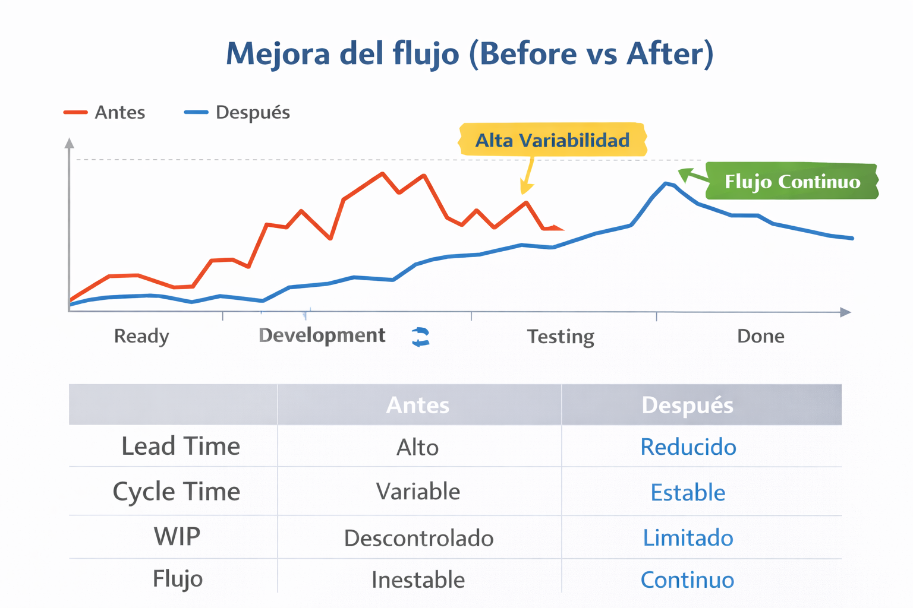

# 📊 Métricas de Flujo — Gestión Basada en Datos

## 🎯 Objetivo

Definir y utilizar métricas de flujo para:

* Evaluar el desempeño del sistema Kanban
* Identificar cuellos de botella
* Tomar decisiones basadas en datos
* Mejorar la predictibilidad de entrega

---

## 🧩 Contexto del caso

Equipo desarrollando una:

👉 **Aplicación de aprendizaje de inglés para niños de 3 a 8 años**

### Problema inicial

* Alta variabilidad en tiempos de entrega
* Acumulación de trabajo en Testing
* Baja visibilidad del flujo

👉 Resultado:

* Lead Time elevado
* Cycle Time inestable
* Baja capacidad de planificación

---

## 📏 Métricas clave del sistema

---

### ⏱️ Lead Time

Tiempo total desde que una tarea es solicitada hasta que se entrega en producción.

👉 Mide la experiencia del cliente

---

### 🔄 Cycle Time

Tiempo desde que el equipo comienza a trabajar en una tarea hasta que la finaliza.

👉 Mide la eficiencia del equipo

---

### 📦 Throughput

Cantidad de tareas completadas por unidad de tiempo.

👉 Mide la capacidad de entrega

---

### 📊 Work In Progress (WIP)

Cantidad de tareas en curso en un momento dado.

👉 Mide la carga del sistema

---

## 📊 Análisis del sistema (estado inicial)

### 🔍 Observaciones

* Lead Time alto y disperso
* Cycle Time variable
* WIP elevado en Development y Testing
* Throughput bajo

---

### 🚨 Diagnóstico

* Sistema sobrecargado
* Cuello de botella en Testing
* Exceso de multitarea

---

## 📉 Distribución de Lead Time

Esta visualización permite analizar la variabilidad del tiempo de entrega del sistema.

  

### 🔍 Análisis

* Alta dispersión → flujo inestable
* Valores extremos → tareas bloqueadas
* Baja concentración → falta de predictibilidad

👉 Insight: El sistema no es confiable en tiempos de entrega.

---

## 📊 Cumulative Flow Diagram (CFD)

El CFD permite visualizar la evolución del trabajo en cada etapa del flujo.

  

### 🔍 Análisis

* Bandas que se expanden → acumulación (cuello de botella)
* Bandas irregulares → flujo inestable
* Crecimiento lento de Done → baja entrega

👉 Insight: Testing actúa como cuello de botella del sistema.

---

## 🛠️ Decisiones basadas en métricas

A partir del análisis de datos, se implementan las siguientes acciones:

### 1. Reducción de WIP

* Implementación de límites por etapa

---

### 2. Priorización de tareas en progreso

* Enfoque en finalización

---

### 3. Redistribución de capacidad

* Developers apoyan Testing

---

### 4. Gestión de bloqueos

* Identificación y resolución temprana

---

## 📉 Evolución del sistema (Before vs After)

Comparación del comportamiento del sistema antes y después de aplicar mejoras.

  

### 🔍 Análisis

* Reducción de WIP
* Flujo más continuo
* Incremento en tareas completadas

👉 Insight: La implementación de WIP y gestión de flujo estabiliza el sistema.

---

## 📈 Impacto en métricas

| Métrica    | Antes         | Después      |
| ---------- | ------------- | ------------ |
| Lead Time  | Alto          | Reducido     |
| Cycle Time | Variable      | Estable      |
| WIP        | Descontrolado | Limitado     |
| Throughput | Bajo          | Incrementado |

---

## 📊 Interpretación

* Menos WIP → menor tiempo de entrega
* Flujo estable → mayor predictibilidad
* Menos multitarea → mayor eficiencia

---

## 🔗 Relación con el sistema Kanban

Estas métricas permiten validar decisiones tomadas en:

* 🧱 `diseno_tablero_kanban.md`
* 🔄 `simulacion_flujo_trabajo_jira.md`
* 🛠️ `politicas_wip.md`

👉 Las métricas transforman la operación en evidencia.

---

## 💼 Enfoque profesional

Las métricas no son solo indicadores.

Son herramientas para:

* Tomar decisiones
* Ajustar el sistema
* Mejorar resultados

👉 El foco está en el sistema, no en las personas.

---

## 🔥 Insight clave

> No puedes mejorar lo que no puedes medir…
> pero medir sin interpretar tampoco genera valor.

---

## ✅ Conclusión

El uso de métricas permite:

* Entender el comportamiento del sistema
* Detectar problemas reales
* Implementar mejoras efectivas

👉 Kanban se convierte en un sistema de mejora continua basado en datos.
